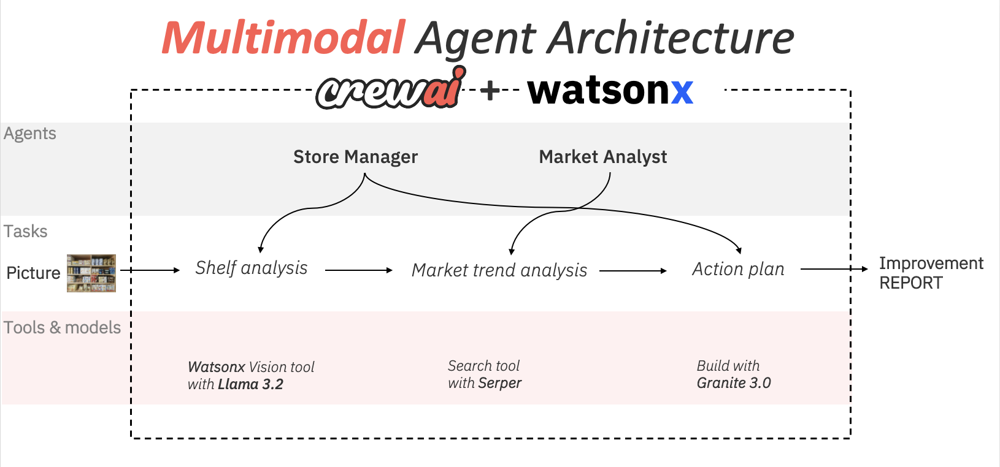
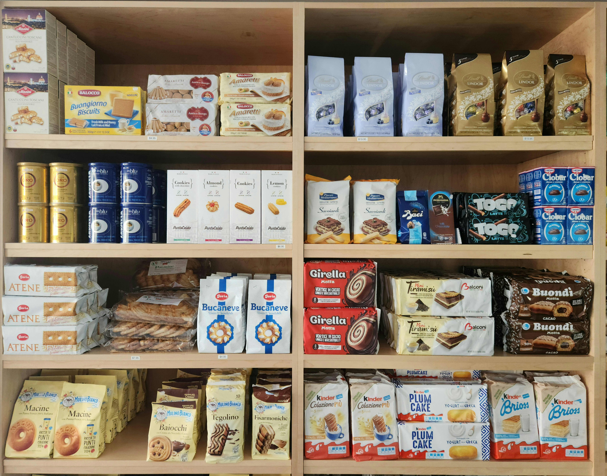

# AI-Powered Retail Shelf Optimization: A Technical Deep Dive



## 1. Introduction
Imagine transforming your retail store’s performance with just a smartphone picture and the power of AI. This isn’t a far-off future scenario—it’s a reality that small and mid-size retail stores can implement today!

In this blog post, we’ll explore an exciting real-world use case where store owners and managers can leverage artificial intelligence to optimize their shelf arrangements, boost sales, and enhance customer experience. The best part? You don’t need to be a tech giant or have a massive budget to make this happen.

With the advent of agent-based generative AI, small and mid-size retail stores now have access to expert-level analysis and recommendations that were once the domain of large corporations with dedicated data science teams. This democratization of AI technology means that your local grocery store, boutique shop, or regional chain can compete on a whole new level.

Here’s what makes this approach so revolutionary:

Simplicity: All you need to start is a simple picture of your store aisle.
Expertise on Demand: The AI agents act as your personal team of retail experts, analyzing your space and current market trends.
Actionable Insights: You’ll receive a detailed, practical plan for rearranging your shelves to maximize sales and customer satisfaction.
Cost-Effective: This approach eliminates the need for expensive consultants or complex software systems.
Adaptability: As market trends change, you can quickly re-analyze and adjust your store layout to stay ahead of the curve.
Let’s dive into the technical details and see how this AI-powered retail optimization works, step by step. By the end of this post, you’ll have a clear understanding of how to implement this system in your own store, potentially revolutionizing your retail space with the power of AI!



## 2. The Story Behind the Solution

Sarah, a local grocery store owner who was struggling to compete with larger chains. Despite her best efforts, she noticed that certain products weren't selling as well as they should, while others were constantly out of stock. One day, while reorganizing her cookie aisle for the third time that month, she wondered if there was a better way.

That's where our AI-powered solution comes in. Using just her smartphone and our intelligent system, Sarah was able to transform her store's performance. Let's dive into how this works and how you can implement it in your store.

## 3. Technical Implementation

### Setting Up the AI-Powered System

The system uses CrewAI, a powerful framework that orchestrates multiple AI agents working together. Think of it as having a team of retail experts available 24/7, each with their own specialty. watsonx.ai provides enterprise performance with models like Llama vision and granite 3.0.

#### 1. The AI Retail Team

Let's meet our retail experts through their configuration:

```yaml
store_manager:
  role: Store Manager
  goal: >
    Analyze the shelves in the physical store and provide a detailed report
    to the market analyst to develop a detailed action plan with the insights.
  backstory: >
    As the Space Planner, you are responsible for examining the store's shelves,
    assessing product placement, and optimizing space utilization.
    You have access to advanced tools for shelf visualization, which help you
    collect accurate data on the current arrangement of products.
    You are capable to translate market analysis into a plan for the store
    or specific shelve or department.

market_analyst:
  role: Market Trend Analyst
  goal: >
    Provide recommendations to rearrange the product arrangement based on market trends.
  backstory: >
    As the Market Analyst, you possess in-depth knowledge of market trends and consumer behavior.
    Your experience and keen sense of retail enable you to propose effective recommendations
    for specific shelves. You analyze reports provided by the Space Planner to suggest
    improvements that enhance sales and customer experience.
```

#### 2. The Task Workflow

Here's how our worker team tackles the shelf improvement process:

```yaml
analyze_shelve:
  description: >
    Use the Vision Tool to collect visual data and caption the current product arrangement.
    Conduct a thorough analysis of shelve {shelve} in the store.
    Prepare a detailed report highlighting the current layout, products,
    product placement, and any observed issues.
    Ensure the report is detailed at the level of product names.
  expected_output: >
    A comprehensive report on shelve {shelve}, including visual data,
    analysis of product placement, space utilization, and any recommendations for improvement.
  agent: store_manager

provide_recommendations:
  description: >
    Review the report on shelve {shelve} provided by the Store Manager.
    Utilize your knowledge of the retail market and internet to assess current trends
    relevant to the products in this shelve ({shelve}).
    Develop expert recommendations to optimize sales and customer satisfaction.
    Ensure the recommendations are detailed and includes details like product names.
  expected_output: >
    A set of actionable recommendations for rearranging the {shelve} shelve,
    aligned with current market trends and consumer preferences.
  agent: market_analyst

create_action_plan:
  description: >
    List the recommendations from the Market Analyst,
    Then develop a detailed action plan for Store manager and Store buyer
    to implement the changes.
    Ensure the plan is practical and outlines the steps needed to rearrange
    the products effectively.
    Be smart and well explained.
    Give the explanation of your recommendations and the goal to achieve.
  expected_output: >
    A detailed list of recommendation and action plan for rearranging and
    improving the {shelve} shelve according to market trends,
    including market analyst recommendations and translation into
    practical tasks for the Store manager and the Buyer.
  agent: store_manager
```

### The Magic in Action

Remember Sarah's cookie aisle problem? Here's how the system helped her:

1. **Visual Analysis**: Sarah took a photo of her cookie aisle with her smartphone. The Store Manager agent analyzed the image and noticed that premium cookies were placed on lower shelves while generic brands occupied prime eye-level spots.

2. **Market Research**: The Market Analyst agent discovered that customers were increasingly interested in artisanal and health-conscious cookie options, and that placing premium products at eye level could increase sales by up to 40%.

3. **Action Plan**: Based on these insights, Sarah received a detailed plan to:
   - Move premium and artisanal cookies to eye level
   - Group health-conscious options together
   - Create a "local favorites" section
   - Adjust inventory levels based on predicted demand

This is an exampel of output that the crew can provide to Sarah in a minute.

## 4. Getting Started

To implement this multi-agent:

### Setup Requirements
   - Clone the repository: `git clone https://github.com/yobens5/Crewai-projects.git`
   - Replace shelve.jpg with your picture

### Environment Setup Requirements
- Python >=3.10 <=3.13
- CrewAI framework
- WatsonX.AI api key and project id
- Serper API key

### Installation Process
```bash
# Create Python virtual environment
python3 -m venv myenv
source ./myenv/bin/activate

# Install CrewAI
crewai install
```

### Project Structure
```
src/my_retail_advisor/
├── config/
│   ├── agents.yaml    # Agent configurations
│   └── tasks.yaml     # Task definitions
├── tool/
│   ├── custom_tool.py # Custom tool implementations
│   └── tool_helper.py # Vision helper functions
├── crew.py           # Crew orchestration
└── main.py          # Application entry point
```

### Configuration Setup

1. **Environment Variables**
Create a `.env` file:
```env
WATSONX_API_KEY=your_key_here
WATSONX_PROJECT_ID=your_project_id
WATSONX_ENDPOINT=your_endpoint
SERPER_API_KEY=your_key_here
```

2. **Custom Vision Tool Implementation**
This custom tool is powered by **llama-3-2-90b-vision-instruct** model on **watsonx.ai**.

```python
# tool/custom_tool.py
from crewai.tools import BaseTool
from my_retail_advisor.tools.tool_helper import Helper

class VisionTool(BaseTool):
    name: str = "Vision Tool"
    description: str = "Analyzes a default picture to collect visual data."

    def _run(self) -> str:
        # Absolute path to the shelve.png image 
        image_path = '<your path>/crewai-projects/my_retail_advisor/shelve.jpg'

        # Simulating image-to-text conversion
        products_in_image = Helper.image2text(image_path)
        return products_in_image
```

### Running the System

```bash
# From project root
crewai run
```

### Output Example
```markdown
**_Action Plan for Rearranging and Improving the Cookie Shelve_**

**_Objective:_**  
*To optimize sales and customer satisfaction by rearranging the cookie shelve according to market trends and recommendations from the Market Analyst.*

**_Market Research:_**  
*The Market Analyst agent discovered that customers were increasingly interested in artisanal and health-conscious cookie options, and that placing premium products at eye level could increase sales by up to 40%.*

**_Recommendations from the Market Analyst:_**

1. *Organize the cookies by type, with healthier options and attractive packaging prominently displayed.*  
2. *Use a combination of vertical and horizontal displays to create visual interest and maximize shelf space.*  
3. *Place high-demand products at eye-level and low-demand products on lower or higher shelves.*  
4. *Consider using shelf dividers or separators to keep products organized and prevent them from becoming askew.*  
5. *Place cookies with similar packaging or branding together to create a cohesive look.*  
...  


**_Action Plan for Store Manager and Store Buyer:_**

**_Step 1: Assessment and Planning (Due Date: 1 week)_**  
...  
*Meet with the Store Buyer and ensure that healthier options and attractive packaging are available.*

**_Step 2: Rearranging the Cookie Shelve (Due Date: 2 weeks)_**  
*Move premium and artisanal cookies to eye level.*  
*Group health-conscious options together.*  
*Create a "local favorites" section.*  
*Adjust inventory levels based on predicted demand.*  
...  
*Install shelf dividers or separators to keep products organized and prevent them from becoming askew.*

...

```

## Conclusion

With AI-powered tools like this, small and medium-sized retailers can not only keep up but thrive. Just like Sarah, we can transform store's performance with technology that's accessible, affordable, and effective.
This architecturealso unlocks other AI opportunities across various domains, such as product design and enhanced customer experience. Its flexibility makes it valuable beyond retail, empowering businesses to innovate and excel in diverse industries. 

Got questions about implementing this in your store? Feel free to reach out in the comments below!
